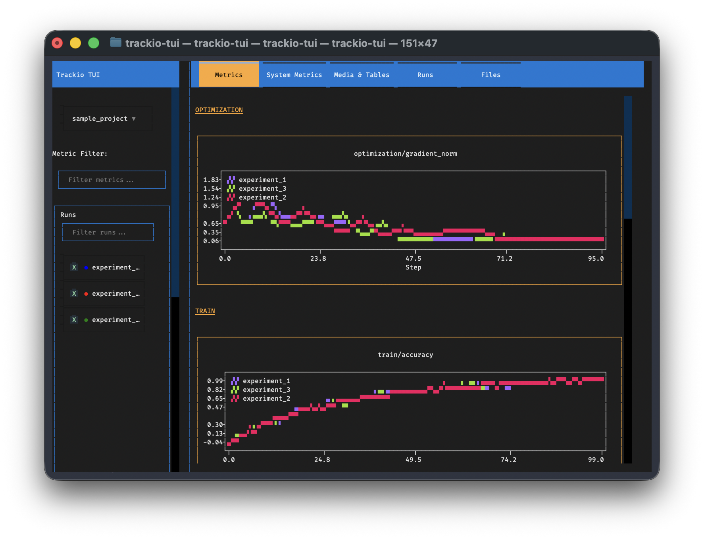

# Trackio VibeTUI

> **⚠️ Notice:** This project is vibe-coded and not thoroughly tested or even fully implemented. Users may be interested in or prefer to use either [trackio-view](https://github.com/mcgrof/trackio-view) (Python) or [trackio-tui](https://github.com/francescorubbo/trackio-tui) (Rust).

Terminal User Interface for Trackio ML experiment tracking. View your training metrics, system statistics, and experiment runs directly in your terminal.



## Features

- 📊 Interactive metric visualization with line plots
- 🎨 Color-coded multi-run comparison
- 🔍 Metric filtering and search
- ⚙️ Configurable chart controls (smoothing, log scales, x-axis)
- 🖥️ Clean terminal interface using Textual framework
- ⚡ Async data loading with caching

## Installation

```bash
pip install -e .
```

Or with development dependencies:

```bash
pip install -e ".[dev]"
```

## Usage

Launch the TUI:

```bash
trackio-vibetui
```

Or run as a Python module:

```bash
python -m trackio_vibetui
```

## Keyboard Shortcuts

- `q` - Quit application
- `r` - Refresh data (clear cache)
- `m` - Show metrics view
- `s` - Show system metrics view (coming soon)
- `n` - Show runs view (coming soon)
- `t` - Show media/tables view (coming soon)
- `f` - Show files view (coming soon)
- `?` - Show help

## Navigation

- Use mouse or keyboard to interact with widgets
- Tab to move between widgets
- Arrow keys in lists and inputs
- Click buttons in the header to switch between views

## Requirements

- Python 3.8+
- Trackio (for ML experiment tracking data)
- Textual (TUI framework)
- textual-plotext (for plotting)

## Development Status

### ✅ Implemented (Phase 1 - MVP)
- Project structure and dependencies
- Data loader with async support and caching
- Metric visualization with PlotextPlot
- Run selector with filtering
- Chart controls (smoothing, log scales, x-axis)
- Main metrics screen
- Basic CSS styling

### 🚧 Coming Soon (Phase 2+)
- System metrics screen
- Runs table view
- Run details screen
- Media & tables viewer
- Files browser
- Auto-refresh functionality
